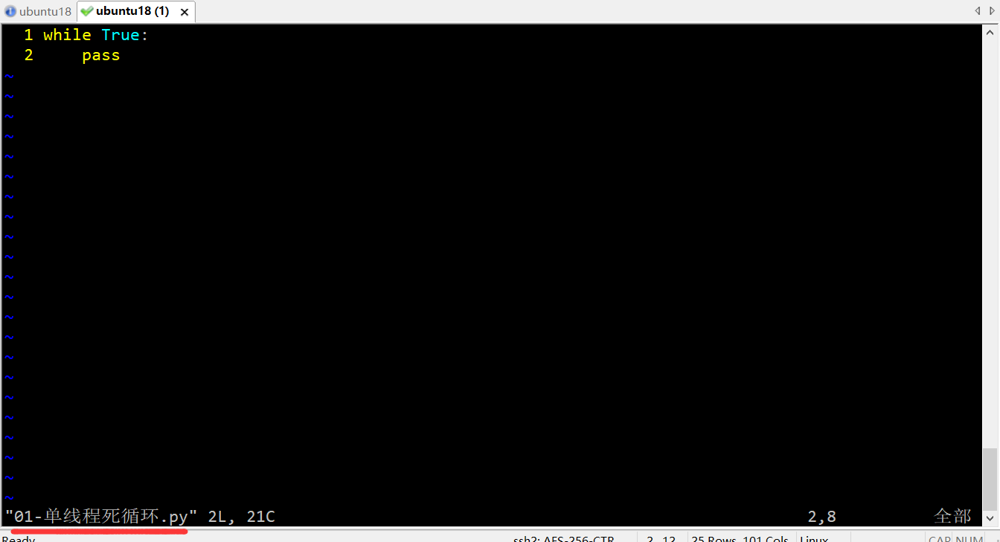
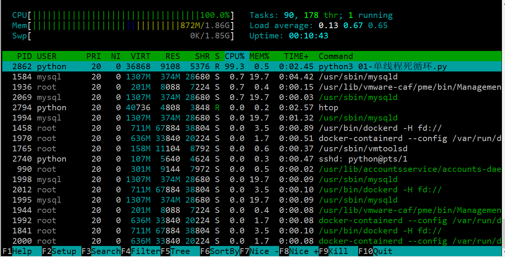
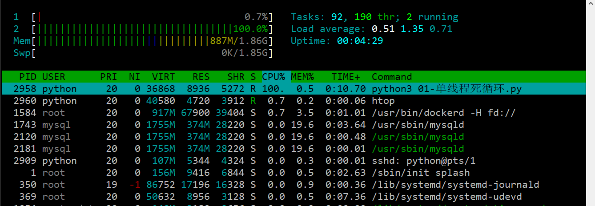
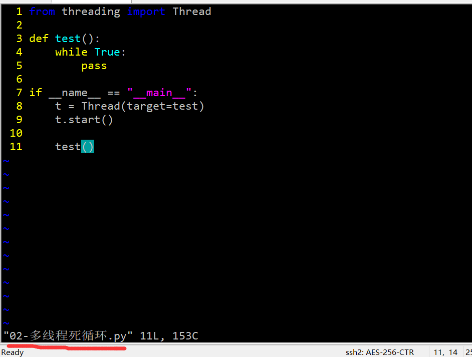
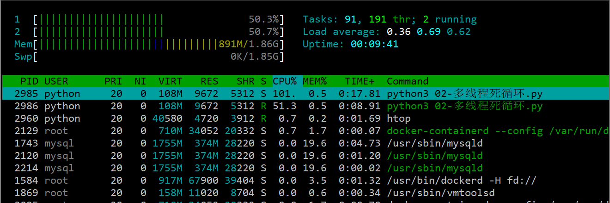
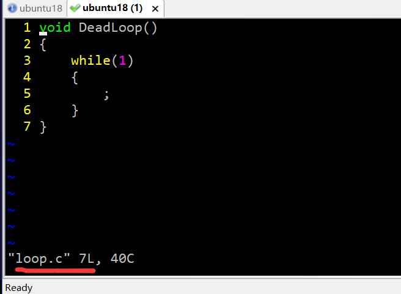
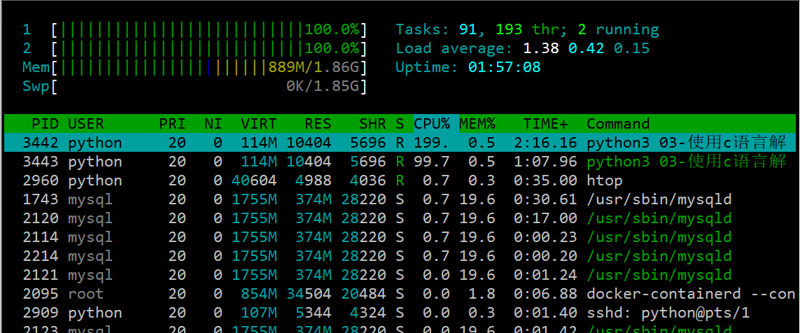

#####1. GIL锁
本质上就是python解释器的锁。导致同一时间，只有一个线程被执行，只有获取到GIL锁，其他线程才能被执行。

#####2. GIL锁演示
2.1. 单核cpu
首先把 虚拟机修改成单核cpu，然后执行如下代码：

执行代码后查看cpu的使用情况：htop

cpu已经100%了，说明GIL锁，对于单核cpu来说几乎没有影响。

2.2. 多核cpu（用2个核举例子）
首先把 虚拟机修改成2核，然后执行文件：01-单线程死循环.py  。查看cpu的使用情况：

可以看到，上图中cpu一个空闲，一个爆满。

然后，结束之前的程序，继续执行代码：02-多线程死循环.py。

查看cpu的使用情况：

可以看到：大约有一半的cpu的处于空闲状态。因为GIL锁的原因，Python对于多核cpu的利用效率很差。

2.3 使用c语言解决GIL锁的问题

编写c 语言代码：

把c文件编译成动态库：gcc loop.c -shared -o libdeadloop.so
执行代码：python3   03-使用c语言解决GIL问题.py , 观察cpu的使用情况：

通过上图，2个核已经爆满。解决了GIL锁的问题。