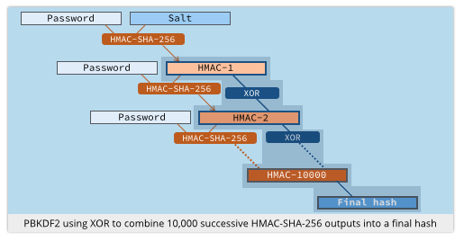

###1、PBKDF2算法
PBKDF2(Password-Based Key Derivation Function)是一个用来导出密钥的函数，常用于生成加密的密码(例如：数据库里保存用户的密码)。

它的基本原理是通过一个伪随机函数（例如HMAC函数），把明文和一个盐值作为输入参数，然后重复进行运算，并最终产生密钥。

如果重复的次数足够大，破解的成本就会变得很高。而盐值的添加也会增加“彩虹表”攻击的难度。

###2、PBKDF2函数的定义
    DK = PBKDF2(PRF, Password, Salt, c, dkLen)
    
        PRF是一个伪随机函数，例如HASH_HMAC函数，它会输出长度为hLen的结果。
    
        Password是用来生成密钥的原文密码。
    
        Salt是一个加密用的盐值。
    
        c是进行重复计算的次数。
    
        dkLen是期望得到的密钥的长度。
    
        DK是最后产生的密钥。

###3、PBKDF2的算法流程
DK的值由一个以上的block拼接而成。block的数量是dkLen/hLen的值。就是说如果PRF输出的结果比期望得到的密钥长度要短，则要通过拼接多个结果以满足密钥的长度：

    DK = T1 || T2 || ... || Tdklen/hlen

而每个block则通过函数F得到：

    Ti = F(Password, Salt, c, i)

在函数F里，PRF会进行c次的运算，然后把得到的结果进行异或运算，得到最终的值。

    F(Password, Salt, c, i) = U1 ^ U2 ^ ... ^ Uc

第一次，PRF会使用Password作为key，Salt拼接上编码成大字节序的32位整型的i作为盐值进行运算。

    U1 = PRF(Password, Salt || INT_32_BE(i))

而后续的c-1次则会使用上次得到的结果作为盐值。

    U2 = PRF(Password, U1)
    ...
    Uc = PRF(Password, Uc-1)

函数F大致的流程图如下： 

