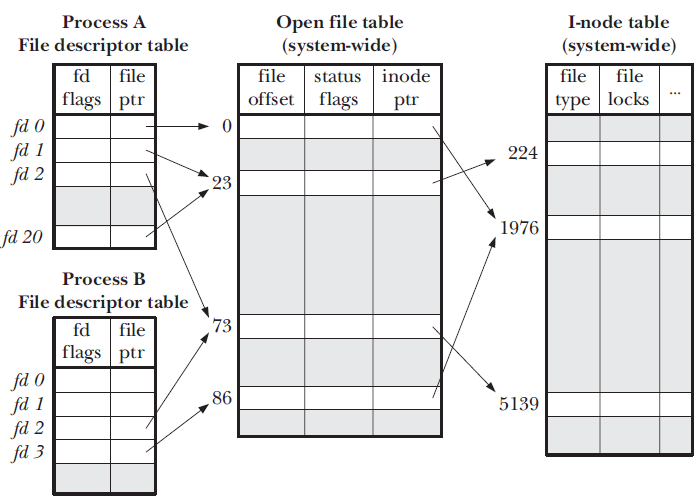

###1. 概述
在Linux系统中一切皆可以看成是文件，文件又可分为：普通文件、目录文件、链接文件和设备文件。文件描述符（file descriptor）是内核为了高效管理已被打开的文件所创建的索引，其是一个非负整数（通常是小整数），用于指代被打开的文件，所有执行I/O操作的系统调用都通过文件描述符。**程序刚刚启动的时候，0是标准输入，1是标准输出，2是标准错误。如果此时去打开一个新的文件，它的文件描述符会是3。**POSIX标准要求每次打开文件时（含socket）必须使用当前进程中最小可用的文件描述符号码，因此，在网络通信过程中稍不注意就有可能造成串话。标准文件描述符图如下：

###2. 文件描述符和打开文件之间的关系
每一个文件描述符会与一个打开文件相对应，同时，不同的文件描述符也会指向同一个文件。相同的文件可以被不同的进程打开也可以在同一个进程中被多次打开。**系统为每一个进程维护了一个文件描述符表**，该表的值都是从0开始的，所以在不同的进程中你会看到相同的文件描述符，这种情况下相同文件描述符有可能指向同一个文件，也有可能指向不同的文件。具体情况要具体分析，要理解具体其概况如何，需要查看由内核维护的3个数据结构。

    1).进程级文件描述符表(file descriptor table)
    2).系统级打开文件表(open file table)
    3).文件系统i-node表(i-node table)

这3个数据结构之间的关系如下图所示：

###3.进程级的文件描述符表

内核为每个进程维护一个文件描述符表，该表每一条目都记录了单个文件描述符的相关信息，包括：

    1) 控制标志(flags)，目前内核仅定义了一个，即close-on-exec
    2) 打开文件描述体指针

###4.系统级的打开文件描述符表

内核对所有打开的文件维护一个系统级别的**打开文件描述表**(open file description table)，简称**打开文件表**。表中条目称为**打开文件描述体**(open file description)，或者称之为**打开文件句柄（open file handle）**存储了与一个打开文件相关的全部信息，包括：

    1) 文件偏移量(file offset)，调用read()和write()更新，调用lseek()直接修改
    2) 访问模式，由open()调用设置，例如：只读、只写或读写等
    3) i-node对象指针

###5. 文件系统i-node表

每个文件系统会为存储于其上的所有文件(包括目录)维护一个i-node表，单个i-node包含以下信息：

    1) 文件类型(file type)，可以是常规文件、目录、套接字或FIFO
    2) 访问权限
    3) 文件锁列表(file locks)
    4) 文件大小
    5) 等等

i-node存储在磁盘设备上，内核在内存中维护了一个副本，这里的i-node表为后者。副本除了原有信息，还包括：引用计数(从打开文件描述体)、所在设备号以及一些临时属性，例如文件锁。

###6.文件描述限制

在编写文件操作的或者网络通信的软件时，初学者一般可能会遇到“Too many open files”的问题。这主要是因为文件描述符是系统的一个重要资源，虽然说系统内存有多少就可以打开多少的文件描述符，但是在实际实现过程中内核是会做相应的处理的，一般最大打开文件数会是系统内存的10%（以KB来计算）（称之为系统级限制），查看系统级别的最大打开文件数可以使用sysctl -a | grep fs.file-max命令查看。与此同时，内核为了不让某一个进程消耗掉所有的文件资源，其也会对单个进程最大打开文件数做默认值处理（称之为用户级限制），默认值一般是1024，使用ulimit -n命令可以查看。在Web服务器中，通过更改系统默认值文件描述符的最大值来优化服务器是最常见的方式之一，具体优化方式请查看http://blog.csdn.net/kumu_linux/article/details/7877770

###总结：
1）
进程A的文件描述符2和进程B的文件描述符2都指向同一个打开文件描述体(标号23)。这种情形很可能发生在调用fork()派生子进程之后，比如A调用fork()派生出B。这时，B作为子进程，从父进程A继承了文件描述符表，其中包括图中标明的文件描述符2。这就是子进程继承父进程打开的文件这句话的由来。

2)
由于进程级文件描述符表的存在，不同的进程中会出现相同的文件描述符，它们可能指向同一个文件，也可能指向不同的文件

3)
两个不同的文件描述符，若指向同一个打开文件句柄，将共享同一文件偏移量。因此，如果通过其中一个文件描述符来修改文件偏移量（由调用read()、write()或lseek()所致），那么从另一个描述符中也会观察到变化，无论这两个文件描述符是否属于不同进程，还是同一个进程，情况都是如此。

4)
文件描述符标志（即，close-on-exec）为进程和文件描述符所私有。对这一标志的修改将不会影响同一进程或不同进程中的其他文件描述符